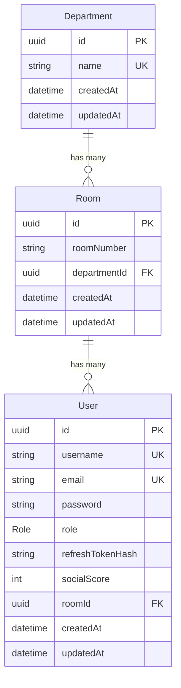
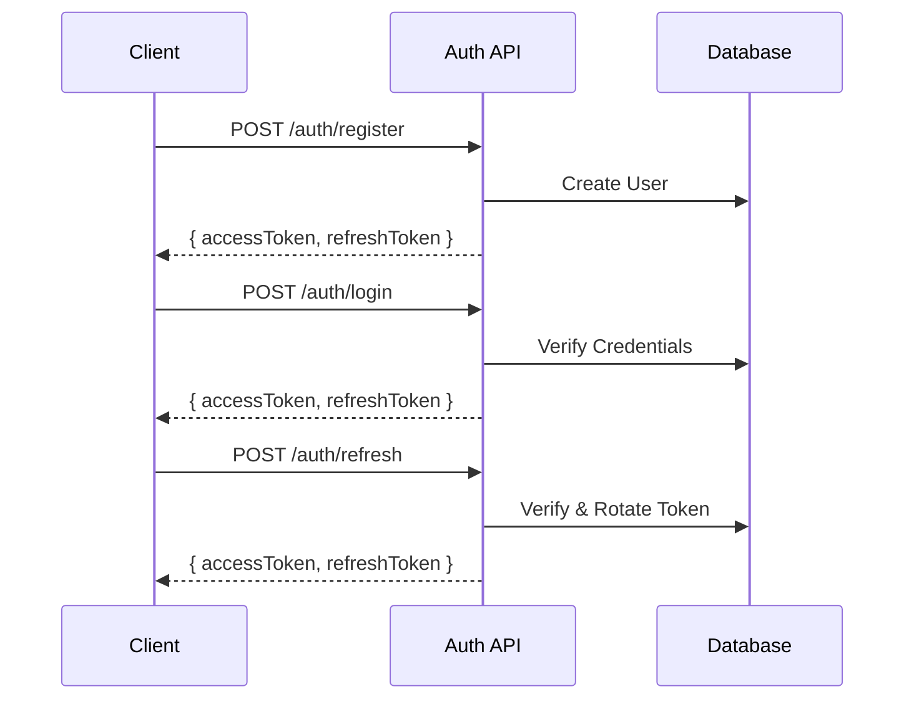

# Dormocracy - Bureau of Hall: Backend Documentation

> **Project Analysis Date:** January 27, 2026  
> **Framework:** NestJS v11 with Fastify  
> **Database:** PostgreSQL with Prisma ORM v7.2

---

## Project Overview

The **Dormocracy - Bureau of Hall** backend is a RESTful API built with NestJS and Fastify, designed for managing a dormitory/hall governance system. The architecture follows a modular approach with four main modules.

### Technology Stack

| Layer | Technology |
|-------|------------|
| Runtime | Node.js with TypeScript 5.7 |
| Framework | NestJS 11 + Fastify |
| ORM | Prisma 7.2 |
| Database | PostgreSQL |
| Authentication | JWT (access + refresh tokens) |
| Password Hashing | Argon2 |
| Validation | class-validator |

---

## Database Schema

### Entity Relationship Diagram



### Models

#### User

| Field | Type | Constraints | Default |
|-------|------|-------------|---------|
| `id` | UUID | Primary Key | Auto-generated |
| `username` | String | **Unique** | Required |
| `email` | String | **Unique** | Required |
| `password` | String | Hashed with Argon2 | Required |
| `role` | Role Enum | - | `USER` |
| `refreshTokenHash` | String? | Nullable | `null` |
| `socialScore` | Int | - | `50` |
| `roomId` | UUID | **Foreign Key → Room** | Required |
| `createdAt` | DateTime | - | Auto |
| `updatedAt` | DateTime | - | Auto |

#### Department

| Field | Type | Constraints | Default |
|-------|------|-------------|---------|
| `id` | UUID | Primary Key | Auto-generated |
| `name` | String | **Unique** | Required |
| `createdAt` | DateTime | - | Auto |
| `updatedAt` | DateTime | - | Auto |

#### Room

| Field | Type | Constraints | Default |
|-------|------|-------------|---------|
| `id` | UUID | Primary Key | Auto-generated |
| `roomNumber` | String | Composite unique with `departmentId` | Required |
| `departmentId` | UUID | **Foreign Key → Department** | Required |
| `createdAt` | DateTime | - | Auto |
| `updatedAt` | DateTime | - | Auto |

### Role Enum

```typescript
enum Role {
  USER     // Default role for residents
  MAYOR    // Hall mayor
  MINISTER // Department minister
  PM       // Prime Minister
  ADMIN    // System administrator
}
```

---

## API Structure

### Base URL
```
http://localhost:3000
```

### Authentication Flow



---

## API Endpoints

### 🔐 Auth Module (`/auth`)

| Method | Endpoint | Auth | Description |
|--------|----------|------|-------------|
| `POST` | `/auth/register` | ❌ Public | Create new user account |
| `POST` | `/auth/login` | ❌ Public | Login and get tokens |
| `POST` | `/auth/refresh` | ❌ Public | Refresh access token |
| `POST` | `/auth/logout` | ✅ JWT | Invalidate refresh token |

#### Register Request
```json
{
  "username": "string (min 3 chars)",
  "email": "string (valid email)",
  "password": "string (min 8 chars)",
  "roomId": "uuid"
}
```

#### Login Request
```json
{
  "email": "string (valid email)",
  "password": "string (min 8 chars)"
}
```

#### Token Response
```json
{
  "accessToken": "JWT",
  "refreshToken": "JWT"
}
```

---

### 👤 Users Module (`/users`)

| Method | Endpoint | Auth | Roles | Description |
|--------|----------|------|-------|-------------|
| `GET` | `/users/me` | ✅ JWT | Any | Get current user profile |
| `PATCH` | `/users/me` | ✅ JWT | Any | Update own username/email |
| `GET` | `/users` | ✅ JWT | ADMIN, PM | List all users |
| `GET` | `/users/:id` | ✅ JWT | ADMIN, PM | Get user by ID |
| `PATCH` | `/users/:id` | ✅ JWT | ADMIN, PM | Update user (incl. role) |
| `DELETE` | `/users/:id` | ✅ JWT | ADMIN | Delete user |

#### Update User DTO (Admin)
```json
{
  "username?": "string",
  "email?": "string (valid email)",
  "role?": "USER | MAYOR | MINISTER | PM | ADMIN",
  "roomId?": "uuid",
  "socialScore?": "integer (min 0)"
}
```

---

### 🏢 Departments Module (`/departments`)

> [!WARNING]  
> Currently **PUBLIC** - Auth guards not yet implemented

| Method | Endpoint | Auth | Description |
|--------|----------|------|-------------|
| `POST` | `/departments` | ❌ Public* | Create department |
| `GET` | `/departments` | ❌ Public* | List all departments (with rooms) |
| `GET` | `/departments/:id` | ❌ Public* | Get department by ID |
| `PATCH` | `/departments/:id` | ❌ Public* | Update department name |
| `DELETE` | `/departments/:id` | ❌ Public* | Delete department |

#### Create/Update Department DTO
```json
{
  "name": "string (min 2 chars)"
}
```

---

### 🚪 Rooms Module (`/rooms`)

> [!WARNING]  
> Currently **PUBLIC** - Auth guards not yet implemented

| Method | Endpoint | Auth | Description |
|--------|----------|------|-------------|
| `POST` | `/rooms` | ❌ Public* | Create room under department |
| `GET` | `/rooms` | ❌ Public* | List all rooms (with dept & users) |
| `GET` | `/rooms/:id` | ❌ Public* | Get room by ID |
| `PATCH` | `/rooms/:id` | ❌ Public* | Update room |
| `DELETE` | `/rooms/:id` | ❌ Public* | Delete room |

#### Create Room DTO
```json
{
  "roomNumber": "string (min 1 char)",
  "departmentId": "uuid"
}
```

---

## Module Architecture

```
backend/
├── prisma/
│   ├── schema.prisma          # Database schema
│   └── migrations/            # Migration files
├── src/
│   ├── main.ts                # App entry (Fastify + ValidationPipe)
│   ├── app.module.ts          # Root module
│   │
│   ├── auth/
│   │   ├── auth.module.ts
│   │   ├── auth.controller.ts # 4 endpoints
│   │   ├── auth.service.ts    # Token generation, registration, login
│   │   ├── dto/
│   │   │   ├── register.dto.ts
│   │   │   └── login.dto.ts
│   │   ├── guards/
│   │   │   ├── jwt-auth.guard.ts
│   │   │   └── roles.guard.ts
│   │   ├── strategies/
│   │   │   └── jwt.strategy.ts
│   │   └── decorators/
│   │       └── roles.decorator.ts
│   │
│   ├── users/
│   │   ├── users.module.ts
│   │   ├── users.controller.ts  # 6 endpoints
│   │   ├── users.service.ts
│   │   └── dto/
│   │       └── update-user.dto.ts
│   │
│   ├── departments/
│   │   ├── departments.module.ts
│   │   ├── departments.controller.ts  # 5 endpoints
│   │   ├── departments.service.ts
│   │   └── dto/
│   │       ├── create-department.dto.ts
│   │       └── update-department.dto.ts
│   │
│   ├── rooms/
│   │   ├── rooms.module.ts
│   │   ├── rooms.controller.ts  # 5 endpoints
│   │   ├── rooms.service.ts
│   │   └── dto/
│   │       ├── create-room.dto.ts
│   │       └── update-room.dto.ts
│   │
│   └── prisma/
│       ├── prisma.module.ts
│       └── prisma.service.ts   # Database client
```

---

## Security Features

### Authentication
- **JWT Bearer Tokens** extracted from `Authorization` header
- **Access Token**: Short-lived (configurable via `JWT_ACCESS_TTL_SECONDS`, default 15 min)
- **Refresh Token**: Long-lived (configurable via `JWT_REFRESH_TTL_SECONDS`, default 30 days)
- **Token Rotation**: Refresh tokens are rotated on each refresh request

### Password Security
- Passwords hashed using **Argon2** (memory-hard algorithm)
- Refresh token hash stored in database (not the plain token)

### Role-Based Access Control (RBAC)
- Custom `@Roles()` decorator for endpoint protection
- `RolesGuard` checks user's role against required roles
- Hierarchy: `USER < MAYOR < MINISTER < PM < ADMIN`

### Input Validation
- Global `ValidationPipe` with:
  - `whitelist: true` - strips unknown fields
  - `forbidNonWhitelisted: true` - rejects unknown fields
  - `transform: true` - auto-transforms inputs to DTO types

---

## Environment Variables

```env
DATABASE_URL=postgresql://...
JWT_ACCESS_SECRET=your-access-secret
JWT_REFRESH_SECRET=your-refresh-secret
JWT_ACCESS_TTL_SECONDS=900       # Optional, default 15 min
JWT_REFRESH_TTL_SECONDS=2592000  # Optional, default 30 days
PORT=3000                        # Optional
```

---

## Build Status Summary

| Feature | Status | Notes |
|---------|--------|-------|
| Database Schema | ✅ Complete | 3 models + Role enum |
| Prisma Setup | ✅ Complete | With PostgreSQL adapter |
| Auth - Register | ✅ Complete | With password hashing |
| Auth - Login | ✅ Complete | Returns JWT tokens |
| Auth - Refresh | ✅ Complete | Token rotation |
| Auth - Logout | ✅ Complete | Invalidates refresh token |
| Users - CRUD | ✅ Complete | With RBAC guards |
| Users - Self Profile | ✅ Complete | `/me` endpoints |
| Departments - CRUD | ✅ Complete | **Missing auth guards** |
| Rooms - CRUD | ✅ Complete | **Missing auth guards** |
| Validation | ✅ Complete | class-validator DTOs |
| Error Handling | ✅ Complete | Proper HTTP exceptions |

### Total Endpoints: **20**

| Module | Count |
|--------|-------|
| Auth | 4 |
| Users | 6 |
| Departments | 5 |
| Rooms | 5 |

---

## Pending Work / TODOs

> [!IMPORTANT]
> Based on code comments and analysis:

1. **Add Auth Guards to Departments/Rooms** - Currently public
2. **Move Refresh Token to httpOnly Cookie** - Noted in code comment
3. **Add Prisma Seed Script** - Basic structure exists but needs verification
4. **Add Unit/E2E Tests** - Test files exist but minimal coverage
5. **API Documentation** - Consider adding Swagger/OpenAPI
